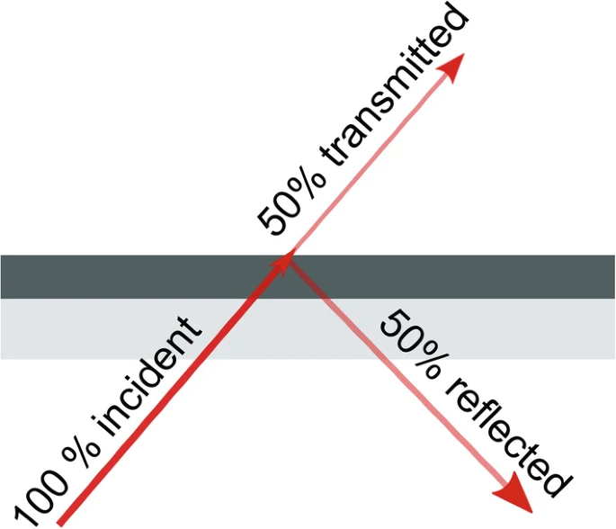

# CP02 - Quântica

- Matéria: Quântica
- Entrega: May 2, 2025
- Tipo: Checkpoint

## Etapa 1

## Etapa 2

### Observe o Estado após o beam splitter 1

Segundo o capítulo *Creating Superposition: The Beam Splitter* do livro *Quantum Computing for the Quantum Curious*, o *beam splitter* desempenha a função de um espelho parcialmente reflexivo, colocando o estado do fóton em superposição de dois estados distintos. Quando o fóton passa pelo *beam splitter*, ele é dividido em dois caminhos possíveis, criando uma combinação dos dois estados.

### Relacione esse estado com o portão Hadamard aplicado ao estado |1> :

Primeiramente, é importante destacar que ao aplicar o portão de Hadarmard  ao estado | 1 > , obtemos a seguinte superposição de estados :

Esta superposição é referente aos estados |0> e |1>, possuindo amplitudes de probabilidade iguais, porém havendo uma fase relativa de π entre eles. Logo, a partir dos princípios da interferência quântica é possível operar o qubit para explorar diversos estados simultaneamente.

No experimento de Mach-Zender, a luz percorre dois caminhos distintos antes de juntar novamente. Sendo assim, ao supor que a luz é composta de fótons, a associação do estado |1> a um único fóton, torna-se possível. Portanto, hipoteticamente a aplicação do portão de Hadamard demonstra a superposição de estados quânticos semelhante a divisão e junção dos fóton de luz explorados no interferômetro de Mach-Zender 

### Compare os resultados e comente :

> O Beam Splitter se comporta como o Hadamard ?
> 

É possível concluir que o Beam Splitter se comporta como o portão Hadamard, em algumas condições, como por exemplo quando não existe um diferencial de fase sendo aplicado ao experimento.

Em suma, nessa situação O beam splitter contribui para a divisão de um fóton de luz para dois caminhos possíveis, desenvolvendo uma superposição equivalente a aplicação do portão de Hadamard a um qubit quântico.

> Quais as diferenças observadas ?
> 

As diferenças podem ser observadas quanto a sua natureza física e aplicação de cada mecanismo.

Por exemplo, o portão de Hadamard é uma operação matemática utilizada na computação quântica para realizar a manipulação dos estados quânticos de um qubit, enquanto o Beam Splitter é um dispositivo físico utilizado em experimentos científicos do campo da óptica, como interferometria, com o intuito de dividir e juntar feixes de luz.

Além disso, o experimento desenvolvido por Mach-Zender permite a aplicação diferencial de fases entre os caminhos percorridos pela luz, a partir da construção e alinhamento do experimento, por outro lado o portão de Hadamard não possibilita esse tipo de aplicação.

## Etapa 3

### Testes com o segundo Beam Splitter:

No capítulo “The Mach-Zehnder Interferometer” no livro Quantum Mechanis: The Theoretical Minimum de Leonard Sussekind e Art Friedman, o segundo Beam Splitterr tem a função de recombinar os caminhos que foram previamente colocados em superposição. Tal recombinação é o que permite a ocorrência da interferência quântica, já que o fóton pode interagir consigo mesmo, dependendo da fase adquirida nos dois caminhos. 

#### Segundo Beam Splitter ativado:

Com o segundo Beam Splitter, os dois estados se sobrepõem novamente, e essa interferência determina em qual detector o fóton será mais provável de ser captado. A partir da fase introduzida, o fóton terá uma alta probabilidade de serem detectados em um determinado detector e quase nunca no outro (100% Detector1, 0% Detector2).

Exemplo de resultado (sem fase): 
- Detector 1: 100%
- Detector 2: 0%
  
Isso mostra que os dois caminhos possíveis do fóton interferem entre si, criando um estado de superposição coerente, como  1/√2(∣0⟩+∣1⟩), que evolui com interferência construtiva ou destrutiva dependendo da fase

#### Segundo Beam Splitter removido:

Quando o segundo Beam Splitter é removido, a superposição não ocorre mais no segundo ponto do circuito. O fóton passa por um dos dois caminhos, mas não interfere consigo mesmo no final. Isso leva a probabilidades clássicas de detecção.

Exemplo de resultado estimado: 
- Detector 1: 50%
- Detector 2: 50%
  
Cada caminho leva diretamente a um detector, e como não há interferência, os fótons se comportam como se escolhessem aleatoriamente o caminho.

## Explique

> Quais são as probabilidades observadas ou estimadas em cada cenário ?
>

Cenário com o segundo Beam Splitter:
	Interferência total  100% em um detector, 0% no outro (dependendo da fase).
 
Cenário sem o segundo Beam Splitter:
	Detecção aleatória clássica  50% em cada detector.

> Por que a probabilidade muda ao remover o segundo Beam Splitter ?
>

Pois o segundo Beam Splitter é o responsável por recombinar os caminhos e permitir que a interferência ocorra. Ao remove-lo, a coerência quântica é destruída e os caminhos tornam-se distinguíveis. Isso impede a superposição quântica final, resultando em um comportamento puramente probabilístico, como na física clássica.

> Isso representa o colapso de qual tipo de estado ?
>

O colapso acontece do estado de superposição coerente (com interferência) para um estado clássico (sem interferência). Na computação quântica, se passa de um estado quântico puro para um estado colapsado, como se tivesse feito uma medição antecipada ao tornar os caminhos distinguíveis.

## Etapa 4

## Etapa 5

### Referências

Hughes, C., Isaacson, J., Perry, A., Sun, R.F., Turner, J. (2021). Creating Superposition: The Beam Splitter. In: Quantum Computing for the Quantum Curious. Springer, Cham. [https://doi.org/10.1007/978-3-030-61601-4_3](https://doi.org/10.1007/978-3-030-61601-4_3)

Hughes, C., Isaacson, J., Perry, A., Sun, R.F., Turner, J. (2021). Quantum Gates. In: Quantum Computing for the Quantum Curious. Springer, Cham. https://doi.org/10.1007/978-3-030-61601-4_6

Susskind, L., & Friedman, A. (2014). Quantum Mechanics: The Theoretical Minimum. Basic Books.
